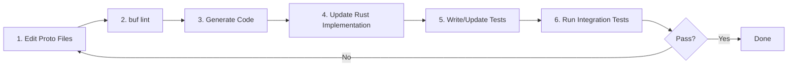

# ProtoSol - Protocol Buffer Wrapper for Solana SDKs

## 🚨 **CRITICAL: MANDATORY LINTING AFTER CODE CHANGES** 🚨

**⚡ NEVER SKIP LINTING AFTER CODE CHANGES ⚡**

After making ANY code changes, you MUST run appropriate linting:

```bash
# All languages (comprehensive check)
./scripts/lint/all.sh

# Language-specific (when you only modified that language):
./scripts/lint/rs.sh    # Only Rust changes
./scripts/lint/go.sh    # Only Go changes  
./scripts/lint/ts.sh    # Only TypeScript changes
```

**MANDATORY WORKFLOW:**
1. Make your code changes
2. **IMMEDIATELY** run appropriate linting script
3. Fix any linting issues that arise
4. Re-run linting until clean
5. ONLY THEN commit/push changes

**🚫 NEVER:**
- Commit without running linting
- Skip linting "for small changes"
- Ignore linting warnings
- **NEVER USE IGNORE DIRECTIVES** like `#[allow(dead_code)]`, `#[allow(clippy::cognitive_complexity)]`, etc. unless explicitly requested

**🚨 CRITICAL: NO IGNORE DIRECTIVES 🚨**

**ALWAYS FIX, NEVER IGNORE:**
- Dead code → DELETE the unused code
- Cognitive complexity → BREAK DOWN into smaller functions
- Missing docs → ADD proper documentation
- Clippy warnings → REFACTOR code to address the underlying issue

**Only use ignore directives (`#[allow(...)]`) when explicitly requested by the user. Default behavior is to FIX the root cause.**

**✅ ALWAYS:**
- Run appropriate linting script after ANY code modification
- Fix all linting issues before committing
- Use `./scripts/lint/all.sh` when changing multiple languages or unsure
- Address root causes, not symptoms

---

## 🎯 Project Mission
ProtoSol provides a language-agnostic gRPC API layer over Solana blockchain operations. It wraps the best-in-class Solana SDKs (primarily Rust) with Protocol Buffer service definitions, enabling automatic SDK generation for any language. This solves the fundamental challenge where your backend needs to be in one language, but the best Solana SDK is in another.

## 🏗️ Core Architecture Philosophy

### 1. Protocol-First Design
- **Source of Truth**: All APIs defined in `lib/proto/protosol/solana/` using Protocol Buffers
- **Versioning**: Every service is versioned (v1) for backward compatibility
- **Standards**: Follows Google AIP resource-oriented design patterns
- **Namespace**: `protosol.solana.[domain].v1` structure

### 2. Composable Transaction Model
The transaction system implements a strict state machine:
```
DRAFT → COMPILED → PARTIALLY_SIGNED → FULLY_SIGNED → SUBMITTED
```
- **DRAFT**: Instructions can be added/removed/modified
- **COMPILED**: Instructions frozen, transaction data generated, read-only
- **PARTIALLY_SIGNED**: Some signatures added
- **FULLY_SIGNED**: All required signatures present, ready for submission
- **Key Principle**: Fee management is CLIENT responsibility (pure SDK wrapper)

### 3. Multi-Language SDK Architecture
- **Rust** (`lib/rust/`): Generated with tonic/prost for backend implementation
- **Go** (`lib/go/`): Generated with custom interfaces via protoc-gen-protosolgo
- **TypeScript** (`lib/ts/`): Generated with @bufbuild/protobuf for browser/Node.js

## 📁 Repository Structure (Verified)

```
protosol/
├── api/                              # Rust backend gRPC service
│   ├── Cargo.toml                   # Package: protosol-solana-api
│   └── src/
│       ├── main.rs                  # gRPC server entry (port 50051)
│       ├── config.rs                # Configuration management
│       ├── service_providers/       # Dependency injection layer
│       │   ├── service_providers.rs # Main provider container
│       │   └── solana_clients.rs    # RPC client management
│       └── api/                     # Service implementations
│           ├── api.rs               # API aggregator
│           ├── account/v1/          # Account service impl
│           │   ├── service_impl.rs  # Service logic
│           │   └── account_v1_api.rs# API wrapper
│           ├── transaction/v1/      # Transaction service impl
│           │   ├── service_impl.rs  # Service logic
│           │   ├── validation.rs    # State machine validators
│           │   └── transaction_v1_api.rs
│           └── program/             
│               └── system/v1/       # System program wrapper
│                   ├── service_impl.rs
│                   ├── conversion.rs # Proto ↔ SDK converters
│                   └── service_impl/tests.rs
│
├── lib/                             # Multi-language SDKs
│   ├── proto/                       # 🔥 SOURCE OF TRUTH
│   │   └── protosol/solana/
│   │       ├── account/v1/          
│   │       │   ├── account.proto   # Account data model
│   │       │   └── service.proto   # Account operations
│   │       ├── transaction/v1/
│   │       │   ├── instruction.proto # Composable instructions
│   │       │   ├── transaction.proto # Transaction lifecycle
│   │       │   └── service.proto    # Transaction operations
│   │       ├── program/system/v1/
│   │       │   └── service.proto   # System program instructions
│   │       └── type/v1/
│   │           ├── commitment_level.proto # Confirmation levels
│   │           └── keypair.proto   # Cryptographic keys
│   ├── _code_gen/
│   │   └── buf.gen.yaml            # Code generation config
│   ├── rust/                       # Generated Rust SDK
│   ├── go/                         # Generated Go SDK + interfaces
│   └── ts/                         # Generated TypeScript SDK
│
├── tests/go/                        # Integration test suite
│   ├── composable_e2e_test.go     # Full transaction lifecycle tests
│   └── config/config.go           # Test configuration
│
├── tool/protoc-gen/cmd/protosolgo/ # Custom protoc plugin
│   └── pkg/generate/               # Go interface generators
│       ├── service_interface.go    # Clean interfaces
│       └── grpc_adaptor.go        # gRPC adaptor pattern
│
├── scripts/                         # 🔧 Automation scripts
│   ├── code-gen/
│   │   ├── generate/all.sh        # Generate all SDKs
│   │   └── clean/all.sh           # Clean generated code
│   └── tests/
│       ├── start-validator.sh     # Local Solana validator
│       └── start-backend.sh       # Start gRPC backend
│
├── buf.yaml                        # Buf configuration
├── go.work                         # Go workspace (multi-module)
└── Cargo.toml                     # Rust workspace
```

## 🔄 CRITICAL Development Workflow

### The Golden Path: Proto → Generate → Implement → Test



### Step-by-Step Workflow

#### 1️⃣ Proto Definition Changes
```bash
# Edit proto files in lib/proto/protosol/solana/
# Example: Adding a new RPC method to transaction service
vim lib/proto/protosol/solana/transaction/v1/service.proto
```

#### 2️⃣ Validate Proto Syntax (ALWAYS from repo root)
```bash
# Run from repository root - buf.yaml is configured here
buf lint

# If you get errors, fix them before proceeding
# Common issues: field numbers, naming conventions, imports
```

#### 3️⃣ Generate Code (ALWAYS use scripts)
```bash
# NEVER manually run buf generate or protoc
# ALWAYS use the provided scripts from repo root
./scripts/code-gen/generate/all.sh

# This script:
# - Validates protos with buf lint
# - Generates Rust code to lib/rust/src/
# - Generates Go code to lib/go/protosol/
# - Generates TypeScript code to lib/ts/src/
# - Runs custom protoc-gen-protosolgo for Go interfaces
```

#### 4️⃣ Implement Service Changes in Rust
```bash
# Navigate to the appropriate service implementation
# Location pattern: api/src/api/[domain]/v1/service_impl.rs

# Example for new transaction method:
vim api/src/api/transaction/v1/service_impl.rs

# Key files to potentially update (depending on the service):
# - service_impl.rs: Core logic implementation (always)
# - mod.rs: Module exports if adding new files
# - validation.rs: For transaction service state machine changes
# - Additional helper files as needed by the specific service
# 
# Note: System program has conversion.rs for proto↔SDK mappings,
#       but this pattern is not universal across all services
```

#### 4.5️⃣ 🚨 **MANDATORY LINTING - NEVER SKIP** 🚨
```bash
# After Rust code modifications:
./scripts/lint/rs.sh

# Or for comprehensive check:
./scripts/lint/all.sh

# CRITICAL: Fix any reported issues before proceeding
```

#### 5️⃣ Update Integration Tests
```bash
# Tests use the generated Go SDK to validate the Rust backend
vim tests/go/composable_e2e_test.go

# Test pattern:
# 1. Use generated Go client from lib/go/
# 2. Call Rust backend on localhost:50051
# 3. Validate full transaction lifecycle
```

#### 6️⃣ Run Full Stack Testing
```bash
# Terminal 1: Start local Solana validator
./scripts/tests/start-validator.sh

# Terminal 2: Start Rust backend
cargo run --package protosol-solana-api
# OR
./scripts/tests/start-backend.sh

# Terminal 3: Run integration tests (auto-detects running services)
cd tests/go
go test -v                                    # Auto-runs if services are up
RUN_INTEGRATION_TESTS=1 go test -v          # Force run (will fail if services down)
RUN_INTEGRATION_TESTS=0 go test -v          # Explicitly skip integration tests
```

### 🚨 WORKFLOW RULES (NEVER Break These)

1. **NEVER** edit generated code (it will be overwritten)
2. **NEVER** run `buf generate` directly (use scripts)
3. **NEVER** skip `buf lint` before generation
4. **NEVER** skip linting after ANY code changes (use appropriate `./scripts/lint/*.sh`)
5. **ALWAYS** run generation script from repo root
6. **ALWAYS** implement both proto change AND Rust implementation
7. **ALWAYS** update tests when adding new functionality

## 🔑 Key Services Explained

### Account Service (`protosol.solana.account.v1`)
Proto: `lib/proto/protosol/solana/account/v1/service.proto`
Impl: `api/src/api/account/v1/service_impl.rs`

```protobuf
service Service {
  rpc GetAccount          // Fetch account data with commitment level
  rpc GenerateNewKeyPair  // Create keypair (deterministic or random)
  rpc FundNative         // Airdrop SOL (devnet/testnet only)
}
```

### Transaction Service (`protosol.solana.transaction.v1`)
Proto: `lib/proto/protosol/solana/transaction/v1/service.proto`
Impl: `api/src/api/transaction/v1/service_impl.rs`

```protobuf
service Service {
  // Lifecycle methods (state machine)
  rpc CompileTransaction  // DRAFT → COMPILED
  rpc SignTransaction     // COMPILED → SIGNED
  rpc SubmitTransaction   // SIGNED → SUBMITTED
  
  // Analysis methods
  rpc EstimateTransaction // Fee calculation
  rpc SimulateTransaction // Dry run
  rpc GetTransaction      // Fetch by signature
}
```

### System Program Service (`protosol.solana.program.system.v1`)
Proto: `lib/proto/protosol/solana/program/system/v1/service.proto`
Impl: `api/src/api/program/system/v1/service_impl.rs`

Returns `SolanaInstruction` messages for composition:
```protobuf
service Service {
  rpc Create             // Create new account
  rpc Transfer           // Transfer SOL
  rpc Allocate          // Allocate space
  rpc Assign            // Change owner
  // ... nonce operations, seed-based operations
}
```

## 🎨 Important Design Patterns

### Proto-to-SDK Conversion Pattern
Location: `api/src/api/program/system/v1/conversion.rs`

```rust
// Proto → SDK
pub fn proto_instruction_to_sdk(instruction: SolanaInstruction) 
  -> Result<Instruction, String>

// SDK → Proto  
pub fn sdk_instruction_to_proto(instruction: Instruction) 
  -> SolanaInstruction
```

### State Machine Validation
Location: `api/src/api/transaction/v1/validation.rs`

```rust
// Enforce state transitions
validate_state_transition(from_state, to_state)

// Check state consistency
validate_transaction_state_consistency(&transaction)

// Guard operations
validate_operation_allowed_for_state(state, operation)
```

### Service Provider Pattern (DI)
Location: `api/src/service_providers/`

```rust
ServiceProviders {
    solana_clients: Arc<SolanaClientsServiceProviders>,
    config: Config,
}
```

### Custom Go Interface Generation
The `protoc-gen-protosolgo` plugin generates:
- `*_interface.passivgo.go`: Clean interfaces without gRPC
- `*_service.passivgo.go`: Client implementation
- `*_grpc_adaptor.passivgo.go`: gRPC adaptor layer

## 🔧 Configuration

### Backend Configuration
```bash
# Environment variables (override config.json)
SOLANA_RPC_URL=http://localhost:8899
SERVER_HOST=0.0.0.0
SERVER_PORT=50051
SOLANA_HEALTH_CHECK_ON_STARTUP=true
SOLANA_TIMEOUT_SECONDS=30
SOLANA_RETRY_ATTEMPTS=3

# OR use config.json in api/ directory
```

### Test Configuration
```json
// tests/go/local-config.json
{
  "solana_rpc_url": "http://localhost:8899",
  "backend_grpc_endpoint": "localhost",
  "backend_grpc_port": 50051
}
```

### Commitment Levels (Default: CONFIRMED)
- **PROCESSED**: Fastest, least reliable
- **CONFIRMED**: Balanced (default everywhere)
- **FINALIZED**: Slowest, most reliable

## 📝 Adding New Features

### Adding a New Solana Program
1. Create proto: `lib/proto/protosol/solana/program/[name]/v1/service.proto`
2. Define methods returning `SolanaInstruction`
3. Run: `buf lint && ./scripts/code-gen/generate/all.sh`
4. Implement: `api/src/api/program/[name]/v1/service_impl.rs`
5. Add converter: `api/src/api/program/[name]/v1/conversion.rs`
6. Wire up in: `api/src/api/program/program.rs`
7. Test: `tests/go/[name]_test.go`

### Adding a New Transaction Operation
1. Edit: `lib/proto/protosol/solana/transaction/v1/service.proto`
2. Run: `buf lint && ./scripts/code-gen/generate/all.sh`
3. Update: `api/src/api/transaction/v1/service_impl.rs`
4. If state change: Update `api/src/api/transaction/v1/validation.rs`
5. Test state machine: `tests/go/composable_e2e_test.go`

## ⚡ Integration Test Auto-Detection System

### Usage
```bash
# Normal workflow - auto-detects services:
./scripts/tests/start-validator.sh    # Terminal 1
./scripts/tests/start-backend.sh      # Terminal 2
go test -v                            # Terminal 3: auto-runs if services up

# Override options:
RUN_INTEGRATION_TESTS=1 go test -v   # Force run (fails if services down)
RUN_INTEGRATION_TESTS=0 go test -v   # Explicitly skip
```

### Error Messages
```bash
# When services aren't running (helpful guidance):
Integration tests skipped - Solana validator or backend not running. Start them with:
  Terminal 1: ./scripts/tests/start-validator.sh  
  Terminal 2: ./scripts/tests/start-backend.sh
  Or set RUN_INTEGRATION_TESTS=1 to force run (tests will fail)

# When explicitly disabled:
Integration tests explicitly disabled with RUN_INTEGRATION_TESTS=0
```

## 🐛 Troubleshooting

### Proto Issues
```bash
# Lint failures
buf lint  # Shows exact line/column of issues

# Generation failures
# Check buf.gen.yaml paths are correct
cat lib/_code_gen/buf.gen.yaml

# Clean and regenerate
./scripts/code-gen/clean/all.sh
./scripts/code-gen/generate/all.sh
```

### Backend Issues
```bash
# Port already in use
lsof -i :50051  # Find process
kill -9 [PID]   # Kill it

# Can't connect to Solana
curl http://localhost:8899 -X POST -H "Content-Type: application/json" \
  -d '{"jsonrpc":"2.0","id":1,"method":"getHealth"}'

# Check logs
cargo run --package protosol-solana-api 2>&1 | tee debug.log
```

### Test Issues
```bash
# Tests timeout
export SOLANA_RPC_URL=http://localhost:8899
export RUN_INTEGRATION_TESTS=1

# Validator not running
solana-test-validator --reset

# Backend not running
./scripts/tests/start-backend.sh
```

## 🛠️ Repository Tooling & Known Issues

### Development Experience Improvements
See [repository-tooling-TODO.md](./repository-tooling-TODO.md) for comprehensive list of tooling improvements and their priority rankings.

### First Integration Run Learnings (2025-08-27)
**Success**: 6/9 integration tests passed on first attempt with real blockchain integration!

**Key Fixes Applied During Setup:**
1. **Script Path Bug**: `scripts/tests/start-backend.sh` had incorrect `PROJECT_ROOT` calculation
2. **Config Structure Bug**: `tests/go/config/config.go` looked for non-existent `api-test` directory  
3. **Legacy References**: Updated workspace member checks and project markers

**Architecture Validation Results:**
- ✅ **Full Stack Working**: Validator → Backend → gRPC → Go SDK → Blockchain
- ✅ **Real Transactions**: Created 4 accounts, submitted 4 transactions, all finalized
- ✅ **Multi-instruction Composition**: Atomic transactions with 3 instructions working
- ✅ **Account Management**: Funding, creation, and transfers all functional
- ✅ **Transaction Estimation**: Fixed compute unit fallback logic for failed simulations
- ✅ **Signing Flow**: Fixed all transaction signing issues - **100% test pass rate achieved (9/9 tests)**
- ✅ **State Machine Logic**: Corrected single-signer transactions properly become FULLY_SIGNED
- ✅ **Proto Serialization**: Fixed nil logs handling for failed simulations

**Blockchain Verification Commands That Worked:**
```bash
# Account balance verification (all successful)
solana balance 82w62sgdBAyS7UqubPj58xDE8VuQYFCFH1HTR1YY8wkK --url http://localhost:8899
solana balance D6GbPRKPbcRckGamaEy9HTmhtba62DoBtaJGGecmjy7Z --url http://localhost:8899

# Transaction confirmation (all finalized)
solana confirm 63UAEzVeMohpwiB59AhgroxN3HdGrXxbAmVKUaRYnJF89b5eMF2sgGE2eePVRrPPkCEPQhgyx8scfvxR9aZYnhvt --url http://localhost:8899

# Transaction history (complete activity log)
solana transaction-history 82w62sgdBAyS7UqubPj58xDE8VuQYFCFH1HTR1YY8wkK --url http://localhost:8899
```

## 🔍 Master-Level Debugging & Testing Guide

### Critical Test Suite Navigation (MUST KNOW)
```bash
# ❌ WRONG - Individual test won't run in testify suites:
go test -v -run "Test_05_TransactionLifecycle_EstimateSimulate"

# ✅ CORRECT - Use SuiteName/TestName pattern:
RUN_INTEGRATION_TESTS=1 go test -v -run "TestComposableE2ESuite/Test_05_TransactionLifecycle_EstimateSimulate"

# ✅ Run specific failing tests to isolate issues:
RUN_INTEGRATION_TESTS=1 go test -v -run "TestComposableE2ESuite/Test_06"
RUN_INTEGRATION_TESTS=1 go test -v -run "TestComposableE2ESuite/Test_07"

# ✅ Integration tests auto-detect running services:
go test -v                           # Auto-runs if services are up
RUN_INTEGRATION_TESTS=1 go test -v  # Force run (will fail if services down)
```

### Cross-Layer Debugging Strategy

When debugging protosol failures, trace through the entire stack:
```
Go Test → gRPC Protocol → Rust Backend → Solana RPC → Local Validator
   ↓           ↓              ↓             ↓            ↓
1. Check Go   2. Check      3. Check      4. Check    5. Check
   test        proto         Rust impl     RPC logs    validator
   assertions  serialization business      & errors    state
              (nil vs empty) logic
```

### Common Issue Patterns & Solutions

#### 1. Proto Serialization Gotchas
```go
// ❌ WRONG - Fails for empty repeated fields:
suite.Assert().NotNil(simulateResp.Logs, "Should have logs")

// ✅ CORRECT - Handle proto empty array → Go nil conversion:
if simulateResp.Success {
    suite.Assert().NotNil(simulateResp.Logs, "Successful simulations should have logs")
} 
// Failed simulations may have nil logs - this is expected
```

#### 2. State Machine Logic vs Test Expectations
```go
// ❌ WRONG TEST EXPECTATION:
suite.Assert().Equal(TRANSACTION_STATE_PARTIALLY_SIGNED, signedTx.State)

// ✅ CORRECT - Single signer transactions become FULLY_SIGNED:
suite.Assert().Equal(TRANSACTION_STATE_FULLY_SIGNED, signedTx.State, 
    "Single signer transaction should be fully signed")
```

#### 3. Private Key Encoding Issues
```go
// ❌ WRONG - Hardcoded hex keys fail:
payerPrivateKey := "342bf55fc1a02135e3e9d6dc2a17849b9a3d29c8a0498532f931325e5424b199"

// ✅ CORRECT - Generate consistent keypairs:
payerResp, err := suite.accountService.GenerateNewKeyPair(suite.ctx, &account_v1.GenerateNewKeyPairRequest{})
payerPrivateKey := payerResp.KeyPair.PrivateKey  // Base58 encoded
```

#### 4. Commitment Level & Timing Issues
```go
// Account visibility delay after funding - use polling:
func waitForAccountVisible(address string) {
    for attempt := 1; attempt <= 10; attempt++ {
        _, err := accountService.GetAccount(ctx, &account_v1.GetAccountRequest{
            Address: address,
            CommitmentLevel: &type_v1.CommitmentLevel_COMMITMENT_LEVEL_CONFIRMED,
        })
        if err == nil {
            return // Success
        }
        time.Sleep(200 * time.Millisecond)
    }
}
```

### Error Message Forensics

Learn to read error messages like a detective:
```
"Invalid private key format: provided string contained invalid character '0' at byte 11"
→ Analysis: Hex string at position 11, backend expects Base58 → Encoding mismatch

"Expected value not to be nil. Should have logs"  
→ Analysis: Proto repeated field became nil instead of empty slice → Serialization issue

"AccountNotFound" during simulation
→ Analysis: Account doesn't exist yet → Timing/sequence issue or test data problem
```

### Parallel Debugging Techniques

Use multiple terminal sessions for faster iteration:
```bash
# Terminal 1: Keep validator running
./scripts/tests/start-validator.sh

# Terminal 2: Monitor backend with logs
cargo run --package protosol-solana-api 2>&1 | tee debug.log

# Terminal 3: Run specific failing tests
cd tests/go
RUN_INTEGRATION_TESTS=1 go test -v -run "TestComposableE2ESuite/Test_06"

# Terminal 4: Check blockchain state
solana balance [ADDRESS] --url http://localhost:8899
solana confirm [SIGNATURE] --url http://localhost:8899
```

### Integration Test Development Patterns

#### Test Structure Template
```go
func (suite *ComposableE2ETestSuite) Test_NewFeature() {
    suite.T().Log("🎯 Testing New Feature")
    
    // 1. Setup - Generate keypairs consistently
    keyResp, err := suite.accountService.GenerateNewKeyPair(suite.ctx, &account_v1.GenerateNewKeyPairRequest{})
    suite.Require().NoError(err, "Should generate keypair")
    
    // 2. Use generated keys throughout test (never hardcode)
    address := keyResp.KeyPair.PublicKey
    privateKey := keyResp.KeyPair.PrivateKey
    
    // 3. Handle timing - fund and wait for visibility
    _, err = suite.accountService.FundNative(suite.ctx, &account_v1.FundNativeRequest{
        Address: address,
        Amount: "1000000000", // 1 SOL
    })
    suite.Require().NoError(err, "Should fund account")
    
    // 4. Wait for account to become visible
    suite.waitForAccountVisible(address)
    
    // 5. Test the actual feature
    // ... feature test logic ...
    
    // 6. Verify blockchain state if needed
    suite.T().Logf("✅ Blockchain verification command:")
    suite.T().Logf("   solana balance %s --url http://localhost:8899", address)
}
```

#### State Machine Testing Best Practices
```go
// Always test state transitions explicitly
suite.Assert().Equal(transaction_v1.TransactionState_TRANSACTION_STATE_DRAFT, tx.State)

resp, err := suite.transactionService.CompileTransaction(suite.ctx, req)
suite.Require().NoError(err, "Should compile")

suite.Assert().Equal(transaction_v1.TransactionState_TRANSACTION_STATE_COMPILED, resp.Transaction.State)

// Test business logic, not implementation details
// Good: Test that signing produces expected state
// Bad: Test internal signature format details
```

### Debugging Production-Level Issues

#### Service Health Monitoring
```bash
# Check all stack components
curl -s http://localhost:8899 -X POST -H "Content-Type: application/json" \
  -d '{"jsonrpc":"2.0","id":1,"method":"getHealth"}' | jq

# Check backend health (if endpoint exists)
grpc_health_probe -addr localhost:50051

# Process monitoring
lsof -i :8899   # Validator
lsof -i :50051  # Backend
ps aux | grep solana-test-validator
```

#### Advanced Log Analysis
```bash
# Backend logs with structured analysis
cargo run --package protosol-solana-api 2>&1 | grep -E "(ERROR|WARN|Failed|Invalid)"

# Test logs with timing analysis  
RUN_INTEGRATION_TESTS=1 go test -v 2>&1 | grep -E "(FAIL|Error|panic|timeout)"

# Validator logs
tail -f ~/.config/solana/validator.log | grep -E "(ERROR|WARN)"
```

### Repository Investigation Commands
```bash
# Find all test assertions to understand patterns
grep -r "suite\.Assert\|suite\.Require" tests/go/ --include="*.go"

# Find all error handling patterns in backend
grep -r "Status::" api/src/ --include="*.rs" -A 2 -B 1

# Find proto serialization patterns
grep -r "unwrap_or_default\|unwrap_or_else" api/src/ --include="*.rs"

# Find hardcoded values that might cause issues
grep -r -E "[0-9a-fA-F]{64}" tests/go/ --include="*.go"
```

### Master-Level Debugging Mindset

1. **Pattern Recognition**: When you see "Invalid private key format", immediately think "encoding mismatch"
2. **State Machine Thinking**: Always trace which state transitions are happening and why
3. **Cross-Language Awareness**: Proto empty arrays become nil in Go, not empty slices  
4. **Timing Sensitivity**: Blockchain operations have timing - account visibility, transaction confirmation
5. **Error Message Precision**: Error messages often contain the exact solution if read carefully
6. **Parallel Investigation**: Use multiple terminals/tools simultaneously for faster diagnosis

## 🚀 Quick Commands Reference

```bash
# Daily Development
buf lint                                    # Validate protos
./scripts/code-gen/generate/all.sh        # Generate all SDKs
cargo run --package protosol-solana-api   # Run backend
cargo test                                 # Run Rust unit tests

# Testing
./scripts/tests/start-validator.sh        # Start Solana
./scripts/tests/start-backend.sh          # Start backend
cd tests/go && go test -v                         # Auto-runs if services up
cd tests/go && RUN_INTEGRATION_TESTS=1 go test -v -run "TestComposableE2ESuite/Test_06"  # Specific test

# Cleanup
./scripts/code-gen/clean/all.sh          # Remove generated code
./scripts/tests/stop-backend.sh          # Stop backend
./scripts/tests/stop-validator.sh        # Stop validator

# Build for Production
cargo build --release                     # Optimized backend
cd lib/ts && yarn build                  # TypeScript SDK
cd lib/go && go build ./...              # Go SDK verification
```

## 🎯 Critical Success Patterns

### When Implementing New Features
1. Start with proto definition
2. Always run `buf lint` before generation
3. Use scripts for all generation (never manual commands)
4. Implement conversion functions for proto↔SDK
5. Add validation for any new states/transitions
6. Write integration tests using Go SDK
7. Document commitment level handling

### Code Organization Rules
- Proto files: Domain-driven structure
- Rust impl: Mirror proto structure exactly
- Tests: Colocate with implementation
- Scripts: Single responsibility, composable

### Testing Philosophy
- Unit tests: Rust, alongside implementation
- Integration tests: Go, using generated SDK
- E2E tests: Full transaction lifecycle
- Always test state transitions explicitly

## 📚 Key Files for Context

When working on features, always check these files first:
1. Proto definitions: `lib/proto/protosol/solana/*/v1/*.proto`
2. Service implementation: `api/src/api/*/v1/service_impl.rs`
3. Conversion logic: `api/src/api/*/v1/conversion.rs`
4. State validation: `api/src/api/transaction/v1/validation.rs`
5. Integration tests: `tests/go/composable_e2e_test.go`
6. Generation config: `lib/_code_gen/buf.gen.yaml`

## 🤖 Notes for Claude (Me)

**🚨 RULE #0 - MANDATORY LINTING - NEVER SKIP 🚨:**
After ANY code changes, IMMEDIATELY run appropriate linting script (`./scripts/lint/*.sh`)

When helping with this codebase:
1. ALWAYS check proto files first - they're the source of truth
2. NEVER suggest manual protoc or buf generate commands - use scripts
3. Remember the state machine for transactions is strict and validated
4. Default commitment level is CONFIRMED unless specified
5. All services return `tonic::Status` errors with detailed messages
6. The custom Go plugin generates clean interfaces - use them in tests
7. Integration tests auto-detect services or use `RUN_INTEGRATION_TESTS=1` to force
8. When adding features, follow the workflow EXACTLY as specified
9. After code modifications, run appropriate linting before proceeding

### Critical Debugging Insights (From Deep Testing Experience)
9. **Test Suite Syntax**: Use `TestSuiteName/TestName` pattern for individual testify suite tests
10. **Proto Serialization**: Empty repeated fields become `nil` in Go, not empty slices
11. **State Machine Logic**: Single-signer transactions become FULLY_SIGNED, not PARTIALLY_SIGNED
12. **Encoding Issues**: Backend expects Base58 private keys, never hex strings
13. **Error Message Analysis**: Read error messages forensically - they often contain exact solutions
14. **Cross-Layer Debugging**: Trace Go→gRPC→Rust→Solana RPC→Validator for complex issues
15. **Timing Sensitivity**: Account funding has visibility delays, use polling in tests
16. **Parallel Debugging**: Use multiple terminals for validator/backend/tests/blockchain-checks
17. **Business Logic vs Implementation**: Test expected state transitions, not internal formats
18. **Pattern Recognition**: "Invalid format" → encoding issue, "NotNil failed" → proto serialization
19. **Integration Test Structure**: Always generate keypairs, never hardcode credentials
20. **Commitment Levels**: CONFIRMED commitment prevents timing issues vs PROCESSED