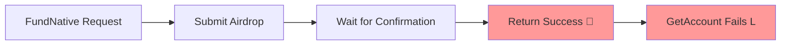
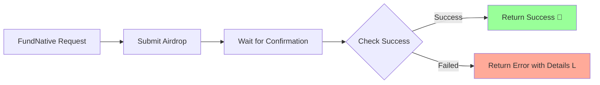

# =¨ Critical Bug: Transaction Monitoring Only Checks Confirmation, Not Success

## Summary
The funding operation (`FundNative`) reports success when a transaction is **confirmed** but **fails** due to business logic errors (e.g., insufficient rent). This creates a false positive where the API returns success, but the account remains unfunded with 0 SOL.

## Root Cause Analysis

### The Problem
Current transaction monitoring logic in `api/src/api/account/v1/service_impl.rs`:
```rust
// L WRONG: Only checks if transaction was confirmed, not if it succeeded
pub async fn fund_native(&self, request: Request<FundNativeRequest>) -> Result<Response<FundNativeResponse>, Status> {
    // ... airdrop logic ...
    
    // Wait for confirmation - BUT NOT SUCCESS
    let confirmed = self.wait_for_confirmation(signature, commitment_level).await?;
    
    // L Returns success even if transaction failed
    Ok(Response::new(FundNativeResponse {
        transaction_signature: signature.to_string(),
    }))
}
```

### What Actually Happened
```
2025-08-31T19:27:31 - Airdrop confirmed successfully: 4UXyWWSTNzzcpSLX61G6kafQ1kDqvuq2WUK3qWaL5pRvyHuRb8Z1zWb6GaPrXXjM3PuLBJh4T9zspNfiRWMFXLmP
2025-08-31T19:27:43 -   get_account_with_commitment returned None for: 9TBwKhZFnWn39x4sW9mj2ph5A3JNxdbVeT8B3FqTUK21

$ solana confirm 4UXyWWSTNzzcpSLX61G6kafQ1kDqvuq2WUK3qWaL5pRvyHuRb8Z1zWb6GaPrXXjM3PuLBJh4T9zspNfiRWMFXLmP --url http://localhost:8899
Transaction failed: Transaction results in an account (1) with insufficient funds for rent

$ solana balance 9TBwKhZFnWn39x4sW9mj2ph5A3JNxdbVeT8B3FqTUK21 --url http://localhost:8899
0 SOL
```

### The Critical Gap
**Confirmation ` Success**
-  **Confirmed**: Transaction was processed by the network
- L **Failed**: Transaction execution failed due to business logic (insufficient rent)
- =¨ **Result**: API reports success, but account has 0 SOL

## Impact Assessment

### Immediate Impact
- **False Positives**: Funding appears successful when it actually failed
- **Silent Failures**: No error propagated to client applications
- **State Inconsistency**: Backend believes account is funded, but blockchain shows 0 SOL
- **Developer Confusion**: Subsequent operations fail mysteriously

### Affected Services
- `account/v1/Service.FundNative` (confirmed affected)
- `transaction/v1/Service.SubmitTransaction` (likely affected)
- Any service that monitors transaction completion

### User Experience Impact
```javascript
// What developers see:
const fundResult = await accountService.fundNative({ 
  address: "9TBwKhZFnWn39x4sW9mj2ph5A3JNxdbVeT8B3FqTUK21", 
  amount: "1" 
});
console.log(" Funding successful!"); // L FALSE POSITIVE

const account = await accountService.getAccount({ 
  address: "9TBwKhZFnWn39x4sW9mj2ph5A3JNxdbVeT8B3FqTUK21" 
});
// L Throws "AccountNotFound" - developer is confused
```

## Technical Details

### Current Flow (Broken)


### Expected Flow (Fixed)


## Reproduction Steps

1. **Start Services**:
   ```bash
   ./scripts/tests/start-validator.sh
   cargo run --package protosol-solana-api
   ```

2. **Fund with Insufficient Amount**:
   ```bash
   # Via gRPC client or UI
   FundNativeRequest {
     address: "9TBwKhZFnWn39x4sW9mj2ph5A3JNxdbVeT8B3FqTUK21",
     amount: "1",  // L Too small for rent exemption
     commitment_level: CONFIRMED
   }
   ```

3. **Observe False Positive**:
   - API returns success
   - Backend logs: "Airdrop confirmed successfully"
   - Account balance: 0 SOL (actual failure)

4. **Verify Failure**:
   ```bash
   solana confirm [SIGNATURE] --url http://localhost:8899
   # Returns: "Transaction failed: Transaction results in an account (1) with insufficient funds for rent"
   ```

## Required Fixes

### 1. Transaction Success Validation
Update `api/src/api/account/v1/service_impl.rs`:
```rust
//  CORRECT: Check both confirmation AND success
pub async fn fund_native(&self, request: Request<FundNativeRequest>) -> Result<Response<FundNativeResponse>, Status> {
    // ... airdrop logic ...
    
    // Wait for confirmation
    let signature = self.wait_for_confirmation(signature, commitment_level).await?;
    
    //  NEW: Check transaction success
    let transaction_result = self.get_transaction_with_meta(signature, commitment_level).await
        .map_err(|e| Status::internal(format!("Failed to fetch transaction details: {}", e)))?;
    
    //  NEW: Validate transaction success
    if let Some(meta) = transaction_result.transaction.meta {
        if meta.err.is_some() {
            let error_details = format!("Transaction failed: {:?}", meta.err.unwrap());
            return Err(Status::failed_precondition(error_details));
        }
    }
    
    Ok(Response::new(FundNativeResponse {
        transaction_signature: signature.to_string(),
    }))
}
```

### 2. Error Message Enhancement
Provide detailed error messages for different failure scenarios:
```rust
match meta.err {
    Some(TransactionError::InsufficientFundsForRent { account_index }) => {
        Err(Status::failed_precondition(
            format!("Transaction failed: Account {} has insufficient funds for rent exemption. Minimum required: ~890,880 lamports", account_index)
        ))
    },
    Some(TransactionError::InsufficientFundsForFee) => {
        Err(Status::failed_precondition(
            "Transaction failed: Insufficient funds to pay transaction fee"
        ))
    },
    Some(err) => {
        Err(Status::failed_precondition(
            format!("Transaction failed: {:?}", err)
        ))
    },
    None => Ok(()) // Success
}
```

### 3. Minimum Funding Amount Validation
Add input validation to prevent common failures:
```rust
//  Validate minimum funding amount
let amount_lamports: u64 = request.amount.parse()
    .map_err(|_| Status::invalid_argument("Invalid amount format"))?;

const MIN_FUNDING_AMOUNT: u64 = 1_000_000_000; // 1 SOL
if amount_lamports < MIN_FUNDING_AMOUNT {
    return Err(Status::invalid_argument(
        format!("Funding amount too small. Minimum: {} lamports (1 SOL) for rent exemption", MIN_FUNDING_AMOUNT)
    ));
}
```

### 4. Apply to Other Transaction Services
Review and fix similar issues in:
- `transaction/v1/Service.SubmitTransaction`
- Any other transaction monitoring logic

## Verification Plan

### Unit Tests
```rust
#[tokio::test]
async fn test_fund_native_insufficient_amount_returns_error() {
    // Test that funding with 1 lamport returns proper error
    let request = FundNativeRequest {
        address: "test_address".to_string(),
        amount: "1".to_string(),
        commitment_level: Some(CommitmentLevel::Confirmed),
    };
    
    let result = service.fund_native(Request::new(request)).await;
    assert!(result.is_err());
    assert!(result.unwrap_err().message().contains("insufficient funds for rent"));
}
```

### Integration Tests
Update `tests/go/composable_e2e_test.go`:
```go
func (suite *ComposableE2ETestSuite) Test_FundNative_InsufficientAmount_ReturnsError() {
    // Test that insufficient funding returns proper error
    _, err := suite.accountService.FundNative(suite.ctx, &account_v1.FundNativeRequest{
        Address: "test_address",
        Amount:  "1", // Insufficient
    })
    
    suite.Require().Error(err, "Should fail with insufficient funding")
    suite.Assert().Contains(err.Error(), "insufficient funds for rent")
}
```

## Priority: =% **CRITICAL**

This bug causes silent failures that create inconsistent state between the API and blockchain. It will confuse developers and cause downstream transaction failures that are difficult to debug.

## Files to Modify
1. `api/src/api/account/v1/service_impl.rs` (primary fix)
2. `api/src/api/transaction/v1/service_impl.rs` (likely similar issue)
3. `tests/go/composable_e2e_test.go` (add regression tests)
4. Add error handling utilities in `api/src/api/common/` (if needed)

## Success Criteria
- [ ] `FundNative` returns proper error for failed transactions
- [ ] Error messages include specific failure reasons
- [ ] Input validation prevents common failure scenarios  
- [ ] Integration tests verify both success and failure paths
- [ ] No false positives in transaction success reporting
- [ ] All transaction monitoring follows confirm + success pattern